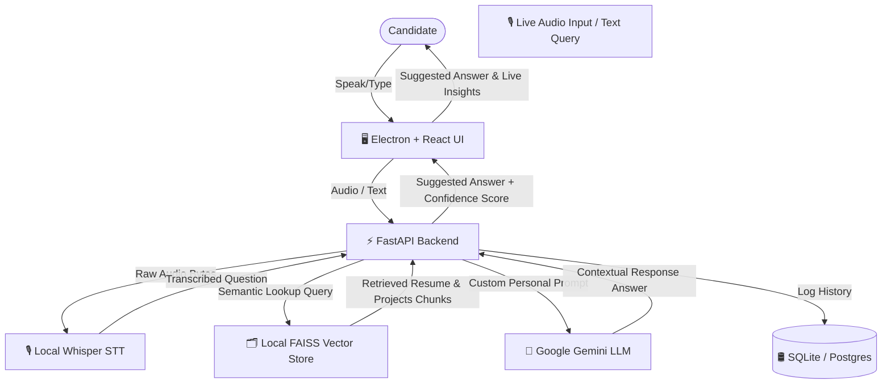

# 🚀 Real-Time AI Interview Copilot (REAI)

[](LICENSE)
[](https://github.com/Modi-Krish/Privacy-Display/issues)
[](https://github.com/Modi-Krish/Privacy-Display/actions)
[](https://github.com/Modi-Krish/Privacy-Display)

An intelligent, low-latency, and privacy-focused full-stack desktop application designed to assist software engineers during technical interviews. It captures real-time meeting audio, performs instant semantic retrieval over your local resume and projects database, and generates contextual suggested answers utilizing Google's Gemini models.

---

## 📸 Project Interface & Layout

The desktop application is built with a dark-themed glassmorphism interface, providing visual feedback including a dynamic AI confidence gauge, live transcription streams, and an integrated workspace browser.

* [App Shell & Live Workspace](frontend/src/components/AppShell.tsx)
* [Dynamic Interview Dashboard](frontend/src/pages/InterviewPage.tsx)
* [Profile Context Manager](frontend/src/pages/ProfilePage.tsx)
* [Workspace Web Browser Sandbox](frontend/src/pages/BrowserPage.tsx)
* [System Configuration Console](frontend/src/pages/SettingsPage.tsx)

---

## 🧠 System Architecture

REAI is built on a concurrent asynchronous pipeline that captures, processes, retrieves, and responds in under two seconds.



---

## 🛠️ Technology Stack

| Domain | Core Technology | Highlights |
|---|---|---|
| **Frontend** | React 18, TypeScript, Electron | ContextBridge Sandboxing, Custom Canvas Gauges |
| **Backend** | Python 3.11, FastAPI, SQLAlchemy | Async Sessions, Custom Middleware, Alembic |
| **AI STT** | `faster-whisper` (Local execution) | `base` model size, Direct `io.BytesIO` processing |
| **Vector Store** | FAISS, `sentence-transformers` | `all-MiniLM-L6-v2` embeddings, In-Memory LRU Eviction Cache |
| **Database** | PostgreSQL / SQLite | Multi-index schemas, Async Pg Drivers |
| **CI/CD** | GitHub Actions | Automated Linting, Typechecks, and Pytest suites |

---

## 🔒 OS Privacy & Security Controls
* **Anti-Screen Share (Anti-Spy):** Toggleable canvas/window level block. When enabled, the application blackouts its contents and mouse cursor in standard screensharing software (Zoom, Discord, Microsoft Teams).
* **Global Privacy Hotkey:** Toggle Privacy Mode on/off immediately using the global key combo:
  `Ctrl + Shift + A + S`
* **Taskbar Stealth Mode:** Dynamically hide the application's taskbar icon from running process listings (use `Alt + Tab` to switch window focus).

---

## ⚙️ Environment Configurations

Create a `.env` file in the root directory from the `.env.example` template:

| Variable | Default | Purpose |
|---|---|---|
| `APP_NAME` | `Real-Time AI Interview Copilot` | The display title of the FastAPI application. |
| `DEBUG` | `false` | Enables reloaders and echo database outputs. |
| `DATABASE_URL` | `sqlite+aiosqlite:///./data/reai.db` | Database connection string (Postgres/SQLite). |
| `SECRET_KEY` | `your_secret_key` | Secret used to sign JWT authentication cookies. |
| `COOKIE_SECURE` | `false` | Enforce SSL `secure` flag on JWT access cookies. |
| `GEMINI_API_KEY` | `(empty)` | Default system-wide Google Gemini API Key. |
| `GEMINI_MODEL` | `gemini-2.5-flash` | Selected model version. |
| `WHISPER_MODEL_SIZE` | `base` | Models: `tiny`, `base`, `small`, `medium` |
| `WHISPER_DEVICE` | `cpu` | Processing device: `cpu` or `cuda` |
| `EMBEDDING_MODEL` | `all-MiniLM-L6-v2` | Embedding model for semantic index. |
| `FAISS_INDEX_PATH` | `./data/faiss_indices` | Target output folder for vector databases. |
| `RATE_LIMIT_PER_MINUTE` | `60` | Limit requests per client ip. |

---

## 🚀 Installation & Deployment

### Option 1: Quick Start with Docker (Recommended)
This method launches both the database and the backend service in containerized environments.

1. Clone and enter directory:
   ```bash
   git clone https://github.com/Modi-Krish/Privacy-Display.git
   cd Privacy-Display
   ```
2. Setup environment configs:
   ```bash
   cp .env.example .env
   # Add your Google Gemini API key inside .env or set it dynamically in the settings UI.
   ```
3. Boot compose stack:
   ```bash
   docker compose up --build -d
   ```
4. Setup and run the Desktop Application:
   ```bash
   cd frontend
   npm install
   npm run dev:electron
   ```

### Option 2: Local Native Execution
For local development, hot-reloading, or executing with custom GPU acceleration configurations.

#### Backend Setup:
1. Initialize virtual environment:
   ```bash
   cd backend
   python -m venv .venv
   .venv\Scripts\activate   # Linux/macOS: source .venv/bin/activate
   ```
2. Install dependencies:
   ```bash
   pip install --upgrade pip
   pip install -r requirements.txt
   ```
3. Run the migrations and start the server:
   ```bash
   # Create SQLite directories
   mkdir data
   # Start Uvicorn
   python -m uvicorn app.main:app --host 127.0.0.1 --port 8000 --reload
   ```

#### Frontend Setup:
1. Install and start:
   ```bash
   cd frontend
   npm install
   npm run dev:electron
   ```

---

## 📡 Core API Reference

The backend app exposes a comprehensive API (fully documented under `/docs` when running).

### Authentication Domain
* `POST /api/auth/register` - Create user account and initialize profile context.
* `POST /api/auth/login` - Authenticate credentials and write HTTP-only cookies.
* `POST /api/auth/logout` - Clear user session and clean active cookies.
* `GET /api/auth/me` - Fetch authenticated user details.

### Profile Context Domain
* `POST /api/resume/upload` - Upload PDF resume, extract text, and rebuild vector search space.
* `DELETE /api/resume` - Clear resume and re-evaluate search space.
* `POST /api/projects` - Add project details and re-index.
* `PUT /api/projects/{id}` - Modify project details and re-index.
* `DELETE /api/projects/{id}` - Remove project details and re-index.
* `POST /api/skills` - Add new skill and re-index.
* `DELETE /api/skills/{id}` - Delete skill and re-index.

### Live Session Domain
* `POST /api/interview/start` - Initialize live session logs.
* `POST /api/interview/question` - Submit transcription or text question, query FAISS database, query Gemini, score confidence, and log.
* `POST /api/interview/end` - Terminate session and return statistical summaries.
* `POST /api/audio/transcribe` - Standalone STT transcription route.

---

## 🤝 Contribution Guidelines
We welcome contributions from developers! Check out [CONTRIBUTING.md](CONTRIBUTING.md) and [CODE_OF_CONDUCT.md](CODE_OF_CONDUCT.md) for details on:
1. Coding standard styles and ESLint rules.
2. Pull Request branch strategy.
3. Bug reporting process.

---

## 🛣️ Future Roadmap
- [ ] **Dynamic WASM Embeddings:** Generate sentence embeddings inside the desktop client using ONNX runtime.
- [ ] **Multi-turn RAG memory:** Inject conversation context histories into prompt builders.
- [ ] **Offline LLM support:** Connect to local endpoints (e.g. Ollama, Llama.cpp) for 100% offline air-gapped security.

---

## 📜 License
Licensed under the [MIT License](LICENSE).
